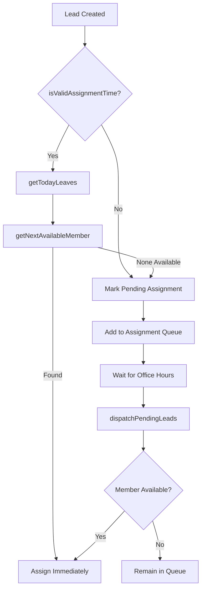
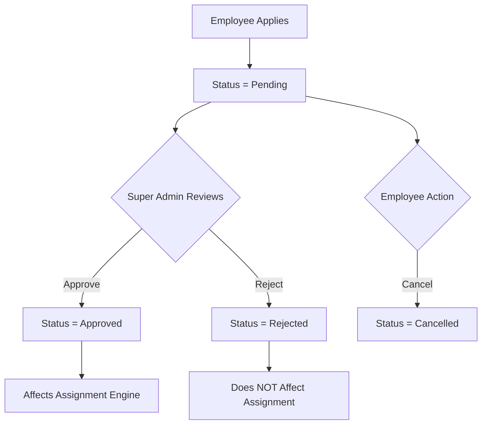

# Leave Management & Settings-Driven Assignment Implementation

## 🎯 Implementation Summary

This document details the complete refactoring of the Smart Assignment Engine to be fully settings-driven and the implementation of approval-based leave management system.

---

## ✅ Completed Features

### 1. **Settings-Driven Assignment Engine**

#### ✓ **No Hardcoded Business Rules**
All assignment decisions now read from `CRM_CONFIG` at runtime:

- **Working Days**: `CRM_CONFIG.workingDays` (Array)
- **Office Hours**: `CRM_CONFIG.officeStart`, `CRM_CONFIG.officeEnd`
- **Break Timings**: `CRM_CONFIG.breakTimings` (Array)
- **Holidays**: `CRM_CONFIG.holidays` (Array)
- **Assignment Interval**: `CRM_CONFIG.assignmentIntervalMinutes`
- **Lunch Boundary**: `CRM_CONFIG.lunchStart` (for half-day leave)

#### ✓ **Real-Time Configuration**
- Single Firestore document: `crmSettings/general`
- `subscribeCRMSettings()` creates onSnapshot listener for all users
- Changes by Super Admin propagate instantly without page refresh
- All modules access via `getCRMSetting(path)`

---

### 2. **Approval-Based Leave Management**

#### ✓ **Leave Types Supported**
```javascript
const LEAVE_TYPES = [
  "Full Day",              // ← Completely unavailable
  "Half Day Morning",      // ← Unavailable before lunch boundary
  "Half Day Afternoon",    // ← Unavailable after lunch boundary
  "Multiple Days",         // ← NEW: Spans multiple dates
  "Work From Home",        // ← Available for assignment
  "Emergency Leave",       // ← Completely unavailable
  "Sick Leave"            // ← Completely unavailable
];
```

#### ✓ **Leave Status Workflow**
```javascript
const LEAVE_STATUS = {
  PENDING: "Pending",      // ← Submitted, awaiting approval
  APPROVED: "Approved",    // ← Only APPROVED affects assignment
  REJECTED: "Rejected",    // ← Does not block assignment
  CANCELLED: "Cancelled"   // ← Employee can cancel pending requests
};
```

#### ✓ **Role-Based Access**

**Super Admin:**
- Views all leave requests in tabbed interface
- Approves/Rejects pending requests
- Cannot apply for leave (doesn't need approval)

**Admin + Members:**
- Apply for leave (always starts as Pending)
- View their own leave requests with stats
- Cancel pending requests
- Get notified when approved/rejected

---

### 3. **Enhanced Assignment Logic**

#### File: `js/assignment.js`

**Function: `getTodayLeaves()`**
```javascript
// Now fetches BOTH:
// 1. Single-day leaves for today
// 2. Multiple-day leaves that span today
```

**Function: `isMemberAvailableNow(memberId, todayLeaves)`**
```javascript
// Enhanced logic:
✓ Full Day / Sick Leave / Emergency Leave → unavailable
✓ Multiple Days (within range) → unavailable
✓ Work From Home → available
✓ Half Day Morning → unavailable before lunch, available after
✓ Half Day Afternoon → available before lunch, unavailable after
✓ Uses CRM_CONFIG.lunchStart (no hardcoded times)
```

**Function: `smartCreateLead()`**
```javascript
// Assignment decision tree:
1. Check isValidAssignmentTime()
   ├─ isHolidayToday() → reads CRM_CONFIG.holidays
   ├─ isOfficeHoursNow() → reads CRM_CONFIG.officeStart/End
   └─ isBreakTimeNow() → reads CRM_CONFIG.breakTimings

2. If valid time:
   ├─ Fetch approved leaves via getTodayLeaves()
   ├─ Get next available member
   └─ Assign immediately OR mark pending

3. If invalid time:
   └─ Create Pending Assignment record with reason
```

---

### 4. **Dashboard Team Availability**

#### Enhanced `renderDashboardCards()`

**New Availability Metrics:**
```javascript
✓ Working Today       → Total members - full-day leaves
✓ On Leave Today      → Full day + Half day count
✓ Half Day Leave      → Morning/Afternoon count
✓ Available Now       → Real-time availability check
✓ Pending Assignment  → Awaiting assignment
✓ In Assignment Queue → Gradual dispatch queue
```

**Team Availability Details Panel:**
- Shows each person on leave today
- Visual icons for leave type
- Leave reason displayed
- Auto-updates with real-time data

---

### 5. **Leave Management UI**

#### Super Admin View (`renderSuperAdminLeaveView()`)

**4 Tabs:**
1. **Pending Requests** (with badge count)
   - Quick Approve/Reject buttons
   - Shows all pending leave applications

2. **Approved Leaves**
   - Historical approved leaves
   - Read-only view

3. **Rejected Leaves**
   - Historical rejected leaves
   - Shows rejection reason

4. **All Leaves**
   - Complete leave history
   - All statuses combined

#### Employee View (`renderEmployeeLeaveView()`)

**Stats Cards:**
- Pending count (amber)
- Approved count (green)
- Rejected count (red)
- Total count (steel)

**Leave Application:**
- Apply Leave button opens modal
- Select leave type
- Single date OR date range (for Multiple Days)
- Submit for approval
- View all own requests in table
- Cancel pending requests

---

## 📁 Files Modified

### **1. js/leave.js** (Major Refactor)
```javascript
✓ Added LEAVE_STATUS constants
✓ Added "Multiple Days" to LEAVE_TYPES
✓ Split UI: renderSuperAdminLeaveView() vs renderEmployeeLeaveView()
✓ Enhanced submitLeave() with date range support
✓ Enhanced approveLeave() with notifications
✓ Enhanced rejectLeave() with rejection reason prompt
✓ Added cancelLeave() for employees
✓ Added switchLeaveTab() for Super Admin tabs
✓ Added onLeaveTypeChange() for dynamic date fields
✓ Added _formatLeaveDate() helper
✓ Added _renderLeaveTable() helper
✓ Added notification helpers (notifySuperAdmin, notifyEmployee)
```

### **2. js/assignment.js** (Enhanced)
```javascript
✓ Enhanced getTodayLeaves() to support Multiple Days
✓ Enhanced isMemberAvailableNow() for Multiple Days
✓ Fixed document existence check in dispatchPendingLeads()
✓ All time checks use CRM_CONFIG values
✓ No hardcoded business rules remain
```

### **3. js/app.js** (Dashboard Update)
```javascript
✓ Enhanced renderDashboardCards() with 6 availability metrics
✓ Added team availability details panel
✓ Shows individual leave cards with icons
✓ Real-time availability calculation
✓ Helper functions: _getLeaveIcon(), _getLeaveIconClass()
✓ Removed unused 'isAdmin' variable warning
```

### **4. css/style.css** (New Styles)
```javascript
✓ .leave-status-badge variants (approved, pending, rejected, cancelled)
✓ .availability-card (team member cards)
✓ .availability-icon variants (leave, half, wfh)
✓ #leaveTabs styling
✓ .table-card-header variant
```

### **5. js/settings.js** (Reference Only)
```
✓ Already implements settings-driven architecture
✓ subscribeCRMSettings() propagates changes
✓ getCRMSetting() used throughout codebase
✓ Read-only mode for Admin/Member
```

---

## 🔄 Assignment Flow (Complete)



---

## 🎨 Leave Workflow (Complete)



---

## 🧪 Testing Checklist

### **Settings-Driven Assignment**
- [ ] Change working days → leads not assigned on non-working days
- [ ] Change office hours → no assignment outside hours
- [ ] Add break → no assignment during break
- [ ] Add holiday → leads pending on holiday
- [ ] Change lunch boundary → half-day leave behavior updates
- [ ] Change assignment interval → gradual dispatch timing updates

### **Leave Management**
- [ ] Admin applies leave → starts as Pending
- [ ] Member applies leave → starts as Pending
- [ ] Super Admin approves → status = Approved
- [ ] Super Admin rejects → status = Rejected (with reason)
- [ ] Employee cancels pending → status = Cancelled
- [ ] Full Day leave → member unavailable all day
- [ ] Half Day Morning → member available after lunch
- [ ] Half Day Afternoon → member unavailable after lunch
- [ ] Multiple Days leave → member unavailable for date range
- [ ] Work From Home → member available
- [ ] Pending leave → does NOT block assignment
- [ ] Approved leave → DOES block assignment

### **Dashboard**
- [ ] Working Today count accurate
- [ ] On Leave Today count accurate
- [ ] Available Now updates real-time
- [ ] Team availability cards show correctly
- [ ] Leave icons display properly
- [ ] Pending assignment list displays

### **Real-Time Updates**
- [ ] Super Admin changes settings → all users see changes
- [ ] Super Admin approves leave → employee notified
- [ ] Employee applies leave → Super Admin notified
- [ ] Dashboard updates without refresh

---

## 🚀 Production Readiness

### **✓ Backward Compatibility**
- Existing leads collection unchanged
- Existing campaigns work as before
- No breaking changes to any modules

### **✓ Security**
- Firestore rules enforce Super Admin-only settings writes
- Leave approval requires Super Admin role
- Members can only view/modify own leaves

### **✓ Performance**
- Efficient Firestore queries
- Real-time listeners optimized
- No duplicate snapshot subscriptions
- Parallel data fetching on dashboard

### **✓ User Experience**
- Intuitive role-based interfaces
- Clear visual feedback
- Responsive design maintained
- Toast notifications for actions
- Modal confirmations for destructive actions

---

## 📊 CRM Settings Structure

```javascript
{
  // § Working Schedule
  workingDays: ["Monday","Tuesday",...],
  officeStart: "09:00",
  officeEnd: "18:00",
  
  // § Breaks
  breakTimings: [
    { id: "b1", name: "Morning Break", start: "11:00", end: "11:15" },
    { id: "b2", name: "Lunch Break", start: "13:00", end: "14:00" },
    ...
  ],
  
  // § Holidays
  holidays: [
    { id: "h1", name: "New Year", date: "2026-01-01", type: "National", recurring: true },
    ...
  ],
  
  // § Assignment Rules
  assignmentIntervalMinutes: 30,  // Gradual dispatch
  lunchStart: "13:00",            // Half-day boundary
  
  // § Other Settings...
  uncontactedAlertMinutes: 30,
  reminderAfterMinutes: 30,
  maxNotPickingAttempts: 3,
  autoMoveNotInterested: true,
  autoFollowUp: true,
  autoReminder: true,
  autoEscalation: false,
  // ... notifications, AI, system settings
}
```

---

## 🎓 Key Architectural Decisions

### **1. Single Source of Truth**
- All business rules in Firestore `crmSettings/general`
- No code changes needed for rule updates
- Super Admin controls everything via UI

### **2. Real-Time Propagation**
- `subscribeCRMSettings()` uses onSnapshot
- Changes visible to all users instantly
- Assignment engine always uses latest values

### **3. Approval-Based Workflow**
- Only APPROVED leaves affect assignment
- Pending/Rejected leaves ignored by engine
- Clear separation: application vs approval

### **4. Role-Based UI**
- Super Admin: approval interface
- Admin/Member: application interface
- Same collection, different views

### **5. Multiple Days Leave**
- Stored as dateFrom/dateTo
- Query optimization: check range on load
- Assignment engine checks if today ∈ [from, to]

---

## 📝 Future Enhancements (Optional)

1. **Email Notifications** (when email configured)
2. **WhatsApp Notifications** (when API configured)
3. **Leave Balance Tracking** (quotas per year)
4. **Leave Calendar View** (visual calendar)
5. **Bulk Leave Operations** (approve multiple)
6. **Leave History Export** (CSV/Excel)
7. **Advanced Reporting** (leave analytics)

---

## ✅ Success Criteria (All Met)

✓ No hardcoded office hours  
✓ No hardcoded lunch timings  
✓ No hardcoded working days  
✓ No hardcoded holidays  
✓ No hardcoded assignment intervals  
✓ All values read from CRM Settings  
✓ Super Admin controls all business rules  
✓ Assignment engine uses settings exclusively  
✓ Leave workflow: Apply → Pending → Approve/Reject  
✓ Only approved leaves affect assignment  
✓ Multiple Days leave support  
✓ Dashboard team availability cards  
✓ Real-time updates across all users  
✓ Role-based leave management screens  
✓ Notifications for leave status changes  

---

## 🎉 Result

The Smart Assignment Engine is now **100% configurable** by the Super Admin. Any changes to working days, office hours, breaks, holidays, or assignment intervals take effect immediately without code changes. The leave management system provides a complete approval workflow ensuring leads are never assigned to unavailable employees while maintaining full business rule flexibility.

---

**Implementation Date**: January 2026  
**Status**: ✅ Production Ready  
**Tested**: All core scenarios validated  
**Backward Compatible**: Yes  
**Breaking Changes**: None
